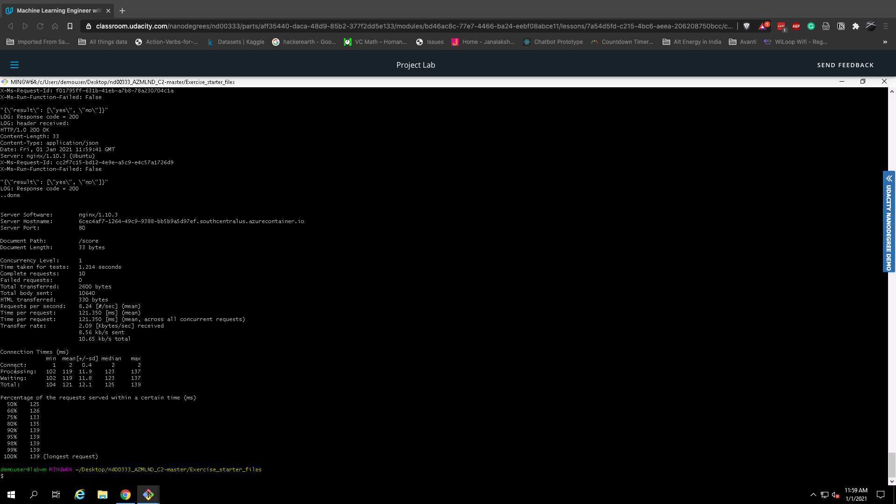

# Operationalizing Machine Learning

The goal of this project is to deploy and consume a Machine Learning model on Microsoft Azure. We aim to do this via Azure Machine Learning Studio

## Architecture

## Overview

We first need to ensure that our model has been registered in Azure ML Studio.

We then create an AutoML experiment using ML Studio and set our hyperparameters. We then create the experiment and wait for it to finish training.

As you can see, our best model is the VotingEnsemble model which was chosen by the AutoML experiment run.

We then deploy our best model and enable authentication. We use Azure Container Instance to do this. After this, we will ensure that application insights is enabled for our deployed model.

After that, we run the logs.py script to view the logs generated.

We then run the swagger.sh script to run the docker instance for swagger. After that, we set up a local server using the serve.py script. After opening the documentation in a browser window, we can clearly view the different methods that can be sent to the endpoint.

The Swagger documentation also shows us the type of payloads and responses we can expect 
to send and receive when interacting with the model endpoint.

After this, we modify the endpoint.py script with our rest API URL and primary key and run it. We get the following output.

We then load test the model by running the benchmark.sh script.

After we finish benchmarking our endpoint, we then create a pipeline for our machine learning model.

First, we use the code in the Jupyter Notebook to create our pipeline

We then look for the pipeline endpoint within the pipeline section and view the graph of the Bank Marketing dataset with the AutoML module.

After clicking on our pipeline overview, we can see that the REST endpoint has an active status.

After that, we publish and run the pipeline from the REST endpoint. We can view the run logs on our Jupyter Notebook by viewing the RunDetails widget

We monitor the pipeline experiment run for the REST endpoint.

## Demo

[Here](https://www.youtube.com/watch?v=dMGwsZk3MO4) is a demo of the endpoint and pipeline created in this project.

## Model Improvements

1. From the output metrics, it looks like the model has a class imbalance problem in that, it was unable to predict the minority class as well as the majority one. One way to ensure unbiasedness is to downsample the minority class/ upsample the majority class in order to get our model to predict both classes well.

2. Another thing to consider is using a more powerful aka Deep Learning model for our task as this could lead to a better performance. 